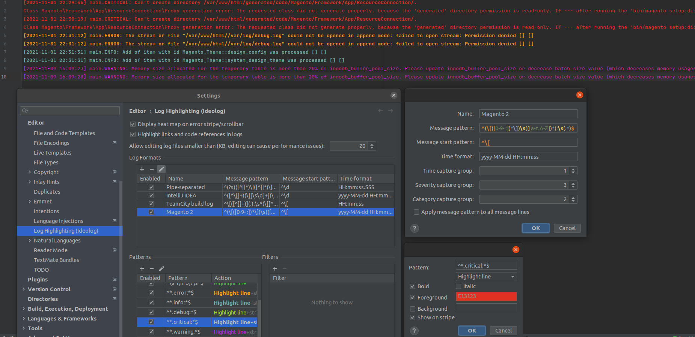

# Cheatsheet for PHPStorm Ideolog Magento 2 logs format

## Requirements

* PHPStorm
* Installed and running **Ideolog** plugin

# Setting up
1. Go to *Settings -> Editor -> Log highlighting (Ideolog)*.
2. Add new *Log format* (plus sign on the right of the top list).
3. Put a name *Magento 2* or whatever suits You.
4. In the field *Message pattern* place this regex: `^(\[([0-9- :])*\])\s(([a-z.A-Z])*):\s(.*)$`
5. In the field *Message start pattern* put this regex: `^\[`.
6. In the field *Time format* put pattern that matches your case, eg.: `yyyy-MM-dd HH:mm:ss`.
7. In the field *Time capture group* set number **1**.
8. In the field *Severity capture group* set number **3**.
9. In the field *Category capture group* set number **2**.
10. Push *OK* button. You're almost done!

# Tweaks

## Critical severity
To make *CRITICAL* severity to highlight do following steps:
1. Go to *Settings -> Editor -> Log highlighting (Ideolog)*.
2. Add new *Pattern* (plus sign on the right of the bottom-left list).
3. Enter new pattern: `^*.critical:*$`
4. Select newly created pattern on the list and click *Edit* icon on the right.
5. Under pattern input box, select *highlight line* option.
6. Check *Foreground*, click on the color field. In new dialog window, choose the appropriate color (I have it red) and click *Choose* button.
7. Uncheck *Background*.
8. Click *OK* button, close settings.

Repeat this for the remaining values `error, info, debug, warning` and now You're done!

There is also a file with settings in the repository `log_highlighting.xml`

#### Here is a screenshot of all the actions described above also with the final result.

